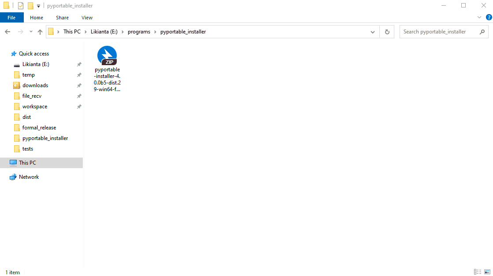
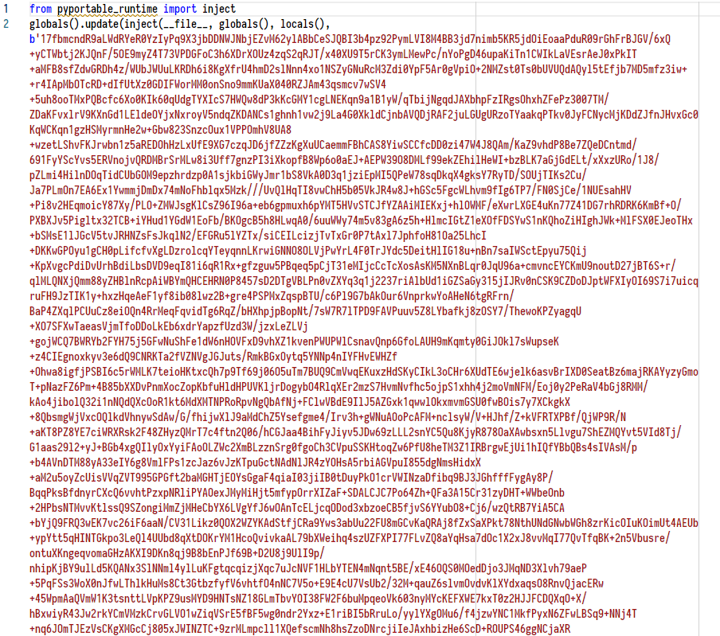

# PyPortable Installer

> pyportable-installer 提供源码版和直装版两个版本供使用. 请根据需要选择:
> 
> | 版本类型 | 说明 | 体积 | 下载方式 |
> | -------- | ---- | ---- | -------- |
> | 第三方库 | 适合开发者在 Python 工程中引入 | 4MB | `pip install pyportable-installer>=4.0.0` |
> | 独立免安装版 (标准版) | 用户下载后解压即可使用, 无需 Python 开发环境, 安装过程需要联网 | TODO | [点我下载 (TODO)]() |
> | 独立免安装版 (完整版) | 用户下载后解压即可使用, 无需 Python 开发环境, 完全离线安装 | TODO | [点我下载 (TODO)]() |
>
> 

--------------------------------------------------------------------------------

`pyportable-installer` 是一个 Python 项目打包工具, 它受启发于 [poetry](https://github.com/python-poetry/poetry), 并旨在作为 [pyinstaller](https://github.com/pyinstaller/pyinstaller) 的替代品出现.

`pyportable-installer` 通过一个 **all-in-one 配置文件** 来管理打包工作, 通过该文件可将您的 Python 项目打包为 "免安装版" 的软件, 用户无需安装 Python 程序或第三方依赖 (注: 该特性需要您在配置中启用虚拟环境选项), 真正做到 "开箱即用, 双击启动".

# 特性

`pyportable-installer` 具有以下特点:

1.  打包后的体积很小. 在不附带虚拟环境的情况下, 与您的源代码同等量级 (这通常只有几百 KB ~ 几 MB 之间)

2.  易于使用. 您只需要维护一个 pyproject.json 配置文件即可. 在快速迭代的环境下, 您甚至只需要更改版本号就能立即生成新的打包结果

3.  打包速度快. 一个中小型项目在数秒间即可生成打包结果

4.  源代码加密. `pyportable-installer` 内置了多种编译和混淆器供选择, 其中推荐使用 [pyportable-crypto](https://github.com/likianta/pyportable-crypto) 库或 [pyarmor](https://github.com/dashingsoft/pyarmor) 库对源代码进行混淆, 保障代码安全

5.  开箱即用. `pyportable-installer` 打包后的目录结构非常清晰, 如下示例:

    

    ```
    my_project
    |= dist
       |= hello_world_0.1.0  # 打包结果
          |= build  # 一些构建信息
             |- mainifest.json
          |= src    # 您的源代码将被编译并放置在此目录下
             |- ...
          |= lib    # 一些自定义的第三方库会放在此目录下, 并在程序启动时加载
             |= pyportable_runtime  # 用于解算加密后的源代码, 保障代码安全
                |- ...
          |= venv   # 自带的虚拟环境 (可选)
             |- ...
          |- README.html    # 自述文档
          |- Hello.exe      # 双击即可启动!
    ```

6.  不破坏相对路径. 在打包后的 `src` 目录下, 所有文件夹仍然维持着原项目的目录结构. 程序在启动时会将工作目录切换到启动脚本所在的目录, 这意味着您在原项目中所使用的相对路径, 在打包后仍然保持一致

7.  摆脱虚拟环境 (该特性仍处于实验阶段). 您可以在 配置文件/虚拟环境配置项 中启用 "[depsland](https://github.com/likianta/depsland)" 选项, 客户端在安装 depsland 软件后, 运行您发布的程序时会自动部署依赖, 这样真正做到打包体积控制, 加快分发并减轻用户下载负担

8.  *无痛更新 (该特性将在后续版本提供). 双击软件目录下的 `checkup/update.pyd` 即可获取软件的最新版本*

9.  *激活和授权 (该特性将在后续版本提供). 该特性由 pyarmor 提供, `pyportable-installer` 将其同样整合在 all-in-one 配置文件中*

# 工作流程

它的流程可以概括如下:

1.  准备您要打包的项目

2.  在项目的根目录下新建一个 all-in-one 配置文件: "pyproject.json"

    1.  该文件名是可以任取的

    2.  [这里](./pyportable_installer/template/pyproject.json) 有一个模板文件可供使用. 以及一个 [手册](./docs/pyproject-template-manual.zh.md) 供查阅每个选项的格式和作用

3.  通过 `pyportable-installer` 处理此配置文件, 完成打包:

    ```py
    from pyportable_installer import full_build
    full_build('./pyproject.json')
    ```

`pyportable-installer` 会为您的项目生成:

> 注: 这里演示的是启用 `pyportable-crypto` 选项加密的效果.

1.  加密后的源代码文件

    1.  加密后的文件后缀仍然是 '.py'

    2.  加密后的文件由 `~/lib/pyportable_runtime` 包在运行时解码

    3.  使用文本编辑器打开加密文件, 其密文如下所示:  

        

2.  一个 exe 格式的启动器

3.  自定义的启动器图标 (注: 缺省图标为 python.ico)

4.  一个干净的虚拟环境 (这是可选的)

5.  整个打包后的结果会以文件夹的形式存在

之后, 您可以将该文件夹制作为压缩文件, 并作为 "免安装版" 的软件发布.

# 安装和使用

通过 pip 安装:

```
pip install pyportable-installer>=4.0.0
```

> 注意事项:
> 
> 1. pyportable-installer 最新发布版本仍处于 beta 阶段, 正式版预计于 2021 年 11 月之前发布
> 2. 上代版本 (3.3.3 及以前) 已不推荐使用
> 3. pyportable-installer 需要 Python 3.8 及以上的解释器运行

下面以一个 "Hello World" 项目为例, 介绍具体的打包工作:

假设 "Hello World" 的项目结构如下:

```
hello_world_project
|= data
   |- names.txt ::
   |     Elena
   |     Lorez
   |     Mei
|= hello_world
   |- main.py   ::
   |     def say_hello(file):
   |         with open(file, 'r') as f:
   |             for name in f:
   |                 print(f'Hello {name}!')
   |
   |     if __name__ == '__main__':
   |         say_hello('../data/names.txt')
|- pyproject.json
|- README.md
```

在项目根目录下新建 'pyproject.json' ([这里](./pyportable_installer/template/pyproject.json) 有一个模板文件可供使用), 填写以下内容:

> 注: '◆◇◆' 标记的是必填的项, 其他可使用缺省设置.

```json5
{
    "app_name": "Hello World",  // ◆◇◆ 应用名称 ◆◇◆
    "app_version": "0.1.0",  // ◆◇◆ 应用版本 ◆◇◆
    "description": "",
    "authors": [],
    "build": {
        "proj_dir": "./hello_world",  // ◆◇◆ 要打包的项目目录 ◆◇◆
        "dist_dir": "./dist/{app_name_lower}_{app_version}",  // ◆◇◆ 打包结果目录 ◆◇◆
        "launcher_name": "{app_name}",
        "icon": "",
        "target": [
            {
                "file": "hello_world/main.py",  // ◆◇◆ 目标脚本 ◆◇◆
                "function": "main",  // ◆◇◆ 目标脚本函数 ◆◇◆
                "args": ["../data/names.txt"],  // ◆◇◆ 目标函数参数 ◆◇◆
                "kwargs": {}
            }
        ],
        "readme": "",
        "attachments": {  // ◆◇◆ 要包含的附件资源清单 ◆◇◆
            "data/names.txt": "assets"
        },
        "attachments_exclusions": [],
        "attachments_exist_scheme": "override",
        "module_paths": [],
        "module_paths_scheme": "translate",
        "venv": {
            "enable_venv": false,  // ◆◇◆ 是否开启虚拟环境 (否: 使用系统 Python) ◆◇◆
            "python_version": "3.9",
            "mode": "source_venv",
            "options": {
                "depsland": {
                    "venv_name": "{app_name_lower}_venv",
                    "venv_id": "",
                    "requirements": [],
                    "offline": false,
                    "local": ""
                },
                "source_venv": {
                    "path": "",
                    "copy_venv": true
                },
                "pip": {
                    "requirements": [],
                    "pypi_url": "https://pypi.python.org/simple/",
                    "offline": false,
                    "local": ""
                },
                "embed_python": {
                    "path": ""
                }
            }
        },
        "compiler": {
            "name": "pyportable_crypto",  // ◆◇◆ 选择一个编译器 ◆◇◆
            "options": {
                "cythonize": {
                    "c_compiler": "msvc",
                    "python_path": "_auto_detect"
                },
                "pyarmor": {
                    "liscense": "trial",
                    "obfuscate_level": 0
                },
                "pyc": {
                    "optimize_level": 0
                },
                "pyportable_crypto": {
                    "key": "_trial",
                    "c_compiler": "msvc",
                    "python_path": "_auto_detect",
                    "note": [
                        "if key is '_trial', it doesn't need to define 'c_compiler' and 'python_path'.",
                        "trial mode is only for development and test purpose."
                    ]
                },
                "zipapp": {
                    "password": ""
                }
            }
        },
        "experimental_features": {
            "add_pywin32_support": false
        },
        "enable_console": true
    },
    "note": "",
    "pyportable_installer_version": "4.0.0b4"
}
```

*注: 更多用法请参考 [Pyproject Template Manual](./docs/pyproject-template-manual.zh.md).*

运行以下代码即可生成打包结果:

```py
from pyportable_installer import full_build
full_build('pyproject.json')

# 当增量更新时, 运行以下:
# from pyportable_installer import min_build
# min_build('pyproject.json')

# 如不需要加密源代码, 运行以下 (仅用于调试!):
# from pyportable_installer import debug_build
# debug_build('pyproject.json')
```

生成的安装包位于 `hello_world/dist/hello_world_0.1.0`:

```
hello_world
|= dist
   |= hello_world_0.1.0
      |= build
         |- manifest.json   # 应用构建信息 (数据已自动去敏, 可伴随项目一起发布)
      |= src
         |= data
            |- names.txt
         |= hello_world
            |- main.py      # 这是加密后的脚本, 与源文件同名
         |- pylauncher.py
      |= lib
         |= pyportable_runtime
            |- __init__.py
            |- inject.pyd
      |- Hello World.exe    # 双击启动
|- ...
```

# 注意事项

1.  要生成的打包目录事先应不存在, 否则 pyportable-installer 会中止打包
2.  如果您启用了虚拟环境选项, 则安装路径不能包含中文, 否则会导致启动失败 (该问题可能与 Embedded Python 解释器有关)
3.  `pyportable-installer` 需要 Python 3.9 解释器运行. 打包的目标 Python 版本可调 (目前对 Python 2.7 和 Python 3.7 以下的版本未做充分测试)

# FAQ

## 程序在启动后会出现一个黑色的控制台, 该怎么隐藏?

在配置文件中将 "enable_console" 选项关闭:

```json
{
    "...": "...",
    "build": {
        "...": "...",
        "enable_console": false
    }
}
```

## 运行报错: 没有找到 tkinter 库

这是因为您发布的项目中的虚拟环境使用的是嵌入式 Python, 而嵌入式 Python 并没有自带 tkinter 库.

解决方法 1 (适用于 v4.0.0b3+): 在配置文件中的实验性功能中启用 "add_tkinter_support":

```json
{
    "...": "...",
    "build": {
        "...": "...",
        "experimental_features": {
            "add_tkinter_support": {
                "enable": true,
                "system_python_path": "_auto_detect"
            }
        }
    }
}
```

解决方法 2: 请参考此文: [如何将 Tk 套件加入到嵌入式 Python 中](./docs/add-tkinter-to-embed-python.md).

## pywin32, win32, win32clipboard 等相关问题

解决方法 1 (适用于 v4.0.0b4+): 在配置文件中的实验性功能中启用 "add_pywin32_support".

解决方法 2: 请参考此文: [Pywin32 库相关问题产生原因及解决方法](./docs/pywin32-problems-and-solutions.zh.md).

## 如何添加图标文件

图标仅支持 ico 格式. 如果您手上只有 png, jpg 等格式的图片文件, 可通过在线网站转换:

- https://www.aconvert.com/cn/image/

或者通过本项目自带的脚本:

*(注意: 需要事先安装 pillow 库.)*

```python
from pyportable_installer.bat_2_exe import png_2_ico

# a) 传入文件名和目标位置
png_2_ico.main('aaa.png', 'my_launcher.ico')

# b) 根据提示传入一个文件名, 会在同一目录下生成 .ico 后缀的同名文件
png_2_ico.dialog()
```

## 如何通过配置文件实现: 打包路径用英文, 启动器名字用中文?

更改配置文件如下所示:

方案 1:

```json5
{
    "app_name": "你好世界",  // 定义应用名为中文. 将生成 "你好世界.exe"
    "build": {
        "dist_dir": "dist/hello_world_{app_version}",  // 这里用英文路径
        "...": "..."
    },
    "...": "..."
}
```

方案 2 (推荐):

```json5
{
    "app_name": "Hello World",  // 仍保持原来的名字
    "build": {
        "dist_dir": "dist/{app_name_lower}_{app_version}",
        "launcher_name": "你好世界",  // 单独修改启动器的名字
        "...": "..."
    },
    "...": "..."
}
```

## pyportable-installer 加密的安全吗?

pyportable-installer 以插件的方式集成了多个编译器支持. 您可以在 `配置文件:compiler:name` 中选择合适的加密方案.

完整的支持列表和各编译器差异可在手册 (TODO) 中查询. 开发者也可以定义自己的编译器来保障安全 (需要继承 `pyportable_installer.compilers.base_compiler.BaseCompiler`).

这里简要介绍下推荐的编译器:

**[pyportable-crypto](https://github.com/likianta/pyportable-crypto)**

pyportable-installer 的姊妹项目之一, 提供开源免费的加密措施.

pyportable-crypto 使用随机步骤生成器产生一个密钥机, 再将密钥机通过 cython 编译为 pyd 文件 (inject.pyd). 由于密钥机内置了密钥 (非固定码文保存), 在发布后附带此密钥机可以解算经同一密钥加密的 py 文件.

值得注意的是 pyportable-crypto 的开发仍处于非常早期的阶段, 任何问题和反馈都欢迎提交到 issues. 在正式版推出之前, 建议使用下面要介绍的 pyarmor 库.

**[pyarmor](https://github.com/dashingsoft/pyarmor)**

阅读此文了解: [PyArmor 的安全性](https://pyarmor.readthedocs.io/zh/latest/security.html).

注意: 请勿使用 pyarmor 试用版加密您的产品! 任何人都可以通过公开的 license 获取到源代码内容. 如需在正式产品中使用 pyarmor, 请 [购买 pyarmor 使用许可](https://pyarmor.readthedocs.io/zh/latest/license.html).

## 虚拟环境各个配置方案的区别, 我该如何选择?

TODO

**[depsland](https://github.com/likianta/depsland)**

TODO
