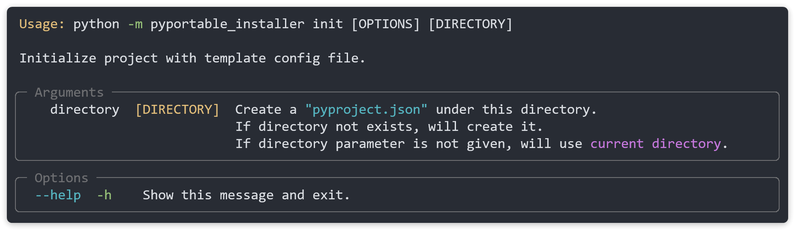

# PyProject Configurations Manual

To package an application, pyportable_installer parses a configuration file to manage what and how to arrange all required assets.

The config file is conventionally named "pyproject.json", and is located under the root of the project. However it could be anyname and anywhere (for [example when we package this project itself](../examples/eg_02_pyportable_installer_bootstrap/pyproject.json)).

The following rules are basically used for config file:

1. All paths mentioned in the file are either absolute, or relative to the file itself.

## How to create it

Check the command help:

```shell
python -m pyportable_installer init --help
```



To create a standard pyproject.json:

```shell
python -m pyportable_installer init
```

<!-- 

*TODO:BelowNotImplemented*

To customize the filename:

```shell
python -m pyportable_installer init <custom_dir> --filename=<custom_name>
```

To use another file format (json, yaml, toml):

```shell
python -m pyportable_installer init --format=<format>
```

(Note: for yaml and toml format, you need to install their related libraries.)

-->

## Configuration Overview

### JSON format

```json
{
    "app_name": "",
    "app_version": "0.1.0",
    "description": "",
    "authors": [],
    "build": {
        "proj_dir": "",
        "dist_dir": "dist/{app_name_kebab}-{app_version}",
        "launchers": {
            "{app_name}": {
                "file": "",
                "icon": "",
                "function": "main",
                "args": [],
                "kwargs": {}
            }
        },
        "readme": "",
        "attachments": {},
        "attachments_exclusions": [],
        "attachments_exist_scheme": "override",
        "module_paths": [],
        "module_paths_scheme": "translate",
        "python_version": "3.8",
        "venv": {
            "enabled": true,
            "mode": "source_venv",
            "options": {
                "depsland": {
                    "venv_name": "{app_name_lower}_venv",
                    "venv_id": "",
                    "requirements": [],
                    "offline": false,
                    "local": ""
                },
                "source_venv": {
                    "path": "",
                    "copy_venv": true
                },
                "pip": {
                    "requirements": [],
                    "pypi_url": "https://pypi.python.org/simple/",
                    "offline": false,
                    "local": ""
                },
                "embed_python": {
                    "path": ""
                }
            }
        },
        "compiler": {
            "enabled": true,
            "mode": "pyportable_crypto",
            "options": {
                "cythonize": {
                    "c_compiler": "msvc",
                    "python_path": "auto_detect"
                },
                "pyarmor": {
                    "license": "trial",
                    "obfuscate_level": 0
                },
                "pyc": {
                    "optimize_level": 0
                },
                "pyportable_crypto": {
                    "key": "{random}"
                },
                "zipapp": {
                    "password": ""
                }
            }
        },
        "experimental_features": {
            "add_pywin32_support": false,
            "platform": "system_default"
        },
        "enable_console": true
    },
    "note": "",
    "pyportable_installer_version": "4.4.0"
}
```

### YAML format

```yaml
app_name: ''
app_version: '0.1.0'
description: ''
authors: []
build:
    proj_dir: ''
    dist_dir: 'dist/{app_name_kebab}-{app_version}'
    launchers:
        '{app_name}':
            file: ''
            icon: ''
            function: 'main'
            args: []
            kwargs: {}
    readme: ''
    attachments: {}
    attachments_exclusions: []
    attachments_exist_scheme: 'overwrite'
    module_paths: []
    module_paths_scheme: 'translate'
    python_version: '3.8'
    venv:
        enabled: true
        mode: 'source_venv'
        options:
            depsland:
                venv_name: '{app_name_lower}_venv'
                venv_id: ''
                requirements: []
                offline: false
                local: ''
            source_venv:
                path: ''
                copy_venv': true
            pip:
                requirements: []
                pypi_url: 'https://pypi.python.org/simple/'
                offline: false
                local: ''
            embed_python:
                path: ''
    compiler:
        enabled: true
        mode: 'pyportable_crypto'
        options:
            cythonize:
                c_compiler: 'msvc'
                python_path: 'auto_detect'
            pyarmor:
                license: 'trial'
                obfuscate_level: 0
            pyc:
                optimize_level: 0
            pyportable_crypto:
                key: '{random}'
            zipapp:
                password: ''
    experimental_features:
        add_pywin32_support: false
        platform: 'system_default'
    enable_console: true
note: ''
pyportable_installer_version: '4.4.0'
```

### TOML format

```toml
app_name = ''
app_version = '0.1.0'
description = ''
authors = []
note = ''
pyportable_installer_version = '4.4.0'

[build]
proj_dir = ''
dist_dir = 'dist/{app_name_kebab}-{app_version}'
readme = ''
attachments = {}
attachments_exclusions = []
attachments_exist_scheme = 'overwrite'
module_paths = []
module_paths_scheme = 'translate'
python_version = '3.8'
enable_console = true

[build.launchers]

    [build.launchers."{app_name}"]
    file = ''
    icon = ''
    function = 'main'
    args = []
    kwargs = {}

[build.venv]
enabled = true
mode = 'source_venv'

[build.venv.options]

    [build.venv.options.depsland]
    venv_name = '{app_name_lower}_venv'
    venv_id = ''
    requirements = []
    offline = false
    local = ''

    [build.venv.options.source_venv]
    path = ''
    copy_venv = true

    [build.venv.options.pip]
    requirements = []
    pypi_url = 'https://pypi.python.org/simple/'
    offline = false
    local = ''

    [build.venv.options.embed_python]
    path = ''

[build.compiler]
enabled = true
mode = 'pyportable_crypto'

[build.compiler.options]

    [build.compiler.options.cythonize]
    c_compiler = 'msvc'
    python_path = 'auto_detect'

    [build.compiler.options.pyarmor]
    license = 'trial'
    obfuscate_level = 0

    [build.compiler.options.pyc]
    optimize_level = 0

    [build.compiler.options.pyportable_crypto]
    key = '{random}'

    [build.compiler.options.zipapp]
    password = ''

[build.experimental_features]
add_pywin32_support = false
platform = 'system_default'
```

## Fields Description

[TOC]

### app_name

- **type**: `str` (required)

- **desc**:

    The application name. Use natual naming style (including letters, spaces, etc.).

    The name will be shown as a launcher's filename, for example in Windows it is "Hello World.exe", in macOS it is "Hello World.app"[^1].

    See also [build.launchers](#20220324181449).

- **example**: "PyPortable Installer"

- **warning**:

    - Do not contain characters which is illegal for filename, for example: !, :, ?, \*, etc.

### app_version

- **type**: `str`

- **desc**:

    The application version.

    Recommend following the [semantic versioning](https://semver.org/).

    The version is usually used to be shown in dist folder as part of the folder name.

- **default**: "0.1.0"

- **example**: "1.0.0", "1.0.0-alpha.1", "1.0.0a0", ...

### description

- **type**: `str`

- **example**: "A simple hello world application."

### authors

- **type**: `list[str]`

- **desc**:

    A list of authors, should contain at least one author.

    Recommended author's form is `name <email>`.

- **example**:

    ```json
    "authors": [
        "Likianta <likianta@foxmail.com>"
    ]
    ```

### build.proj_dir

- **type**: `str[relpath, abspath]` (required)

    <span id="20220324173727"></span>

    - `relpath`: Relative based on where configuration file located.
    - `abspath`: Accepts both forward and backward slashes. (In internal it will all be converted to forward ones.)

- **desc**:

    The directory that mainly contains source code.

    For example:

    ```
    my_project
    |= src
       |= hello_world  # <- this is `proj_dir`
          |- __init__.py
          |- main.py
    |= venv
    |- README.md
    |- pyproject.json
    ```

    Fill it in configuration:

    ```json
    "build": {
        "proj_dir": "src/hello_world"
    }
    ```

- **example**: "src/hello_world"

- **warning**:

    Try to be accurate that the directory should only contain your source code, no venv, third party libs, documents etc.

    If you have a project like this:

    ```
    my_project
    |- hello.py
    |= venv
    |- ...  # chore files that are crowded beside source files
    |- pyproject.json
    ```

    It is recommended you to move `hello.py` under `src/hello.py`.

    Another way is to add `proj_dir = "."` then add `attachments_exclusions = ["./venv", "./pyproject.json", ...]`, because the exclusion rule is higher than proj_dir. See also [build.attachments_exclusions](#20220324171614).

### build.dist_dir

- **type**: `str[relpath, abspath]` (required) ([ref](#20220324173727))

- **desc**:

    The distribuition directory.

    For example:

    ```
    my_project
    |= src
       |= hello_world
          |- main.py
    |= dist
       |= hello-world-0.1.0  # <- this is `dist_dir`
          |= ...
    |- pyproject.json
    ```

    Fill it in configuration:

    ```json
    "build": {
        "dist_dir": "dist/{app_name_kebab}-{app_version}"
    }
    ```

    `dist_dir` supports the following placeholders:

    | Placeholder         | Description            | Example     |
    | ------------------- | ---------------------- | ----------- |
    | `{app_name}`        | app_name               | Hello World |
    | `{app_name_lower}`  | app_name in lower case | hello world |
    | `{app_name_upper}`  | app_name in UPPER CASE | HELLO WORLD |
    | `{app_name_title}`  | app_name in Title Case | Hello World |
    | `{app_name_snake}`  | app_name in snake_case | hello_world |
    | `{app_name_kebab}`  | app_name in kebab-case | hello-world |
    | `{app_name_camel}`  | app_name in camelCase  | helloWorld  |
    | `{app_name_pascal}` | app_name in PascalCase | HelloWorld  |
    | `{app_version}`     | app_version            | 0.1.0       |

- **default**: "dist/{app_name_kebab}-{app_version}"

- **warning**:

    - **Target directory must not exist.** You should delete it before packaging, or (suggested) increase the build number of version to make a new one.
    - **Parent of target directory must exist.** If not, you need to create it manually.

<span id="20220324181449"></span>

### build.launchers

- **type**: `dict[str, any]` (required)

- **desc**:

    `launchers` is a dict. The keys are file names, values are launching parameters.

    Usually there is one key, which is the sole entrance to start your application:

    Example:

    ```
    my_project
    |= assets
       |- launcher.ico
    |= src
       |= hello_world
          |- main.py
          |  ~  def main():
          |  ~      print('Hello World!')
          |  ~  if __name__ == '__main__':
          |  ~      main()
    |- pyproject.json
    ```

    Fill it in configuration:

    ```json
    "build": {
        "launchers": {
            "{app_name}": {
                "file": "src/hello_world/main.py",
                "icon": "assets/launcher.ico",
                "function": "main",
                "args": [],
                "kwargs": {}
            }
        }
    }
    ```

    It generates:

    ```
    dist
    |= hello-world-0.1.0
       |= build
       |= lib
       |= src
          |= .pylauncher_conf
          |= hello_world
             |- ...
          |- pylauncher.py  # 2. pylauncher is handling launching parameters
          |                 #    for target py file (src/hello_world/main.py).
       |= venv
       |- Hello World.exe   # 1. the key of `{app_name}`.
    ```

    *When do we need multiple keys?*

    *TODO*

- **warning**:

    - Keys shouldn't contain characters which is illegal for filename, for example: !, :, ?, \*, etc.
    - Currently (v4.x.x) supports only Windows platform.
    - If target script has no `main` function, leave "function" empty.
    - "icon" is optional. It accepts only ".ico" file. You can convert an image to ico by online tools.
        - If no icon specified, will use Python's default icon.
    - If target script is not under `proj_dir`, fill it like this:

        ```
        my_project
        |= src
           |= hello_world   # 1. `proj_dir`
        |- run.py           # 2. the target file is out of `proj_dir`
        |  ~ from src/hello_world.main import main
        |  ~ main()
        |- pyproject.json
        ```

        ```json
        "build": {
            "proj_dir": "src/hello_world",
            "launchers": {
                "{app_name}": {
                    "file": "./run.py",
                    "icon": "",
                    "function": "",
                    "args": [],
                    "kwargs": {}
                }
            }
        }
        ```

### build.readme

- **type**: `str[relpath, abspath]` (required) ([ref](#20220324173727))

- **desc**:

    (This field is optional.)

    Copy readme file to dist root.

    The file type generally is '.md', '.pdf', '.txt', etc.

### build.attachments

- **type**: `dict[src, dst]`
    - `src` (source): `str[relpath, abspath]` ([ref](#20220324173727))
    - `dst` (distribuition): `str` (to be explained in description below)

- **desc**:

    The attachments define the files outside of `proj_dir` to be copied to dist.

    The keys are source files/directories, values are the ways of WHERE and HOW to copy.

    Value is string that consists of three parts:

    1. assets type: `literal['asset', 'assets', 'root_assets', 'only_folder', 'only_folders']``
        1. `asset`: it means the key is a single file. will do copy from source file to dist file.
        2. `assets`: it means the key is a directory. will do recursive copy from source directory to dist directory.
        3. `root_assets`: it means the key is a directory. will do copy from source directory to dist directory, but not include any sub directories (also not create the empty folders).
        4. `only_folder`: it means the key is a directory. will just make an empty directory in dist side.
        5. `only_folders`: it means the key is a directory. will make an empty tree in dist side.
    2. whether to compile: `literal['compile']`
        1. `compile`: if added, pyportable_installer will walk through source, compile all '.py' scripts to "obfuscated" files.
            1. If source is a file, will compile it to "obfuscated" file.
            2. If source is a directory, will compile all '.py' files in it to "obfuscated" files.
    3. destination: `str`, must start with 'dist:'

        If added, you are defining a custom destination location to copy.

        If not, let pyportable_installer to decide where to put it.

        For example:

        ```json
        "build": {
            "attachments": {
                "docs/exported/readme-client-1.pdf": "",
                "docs/exported/readme-client-2.pdf": "dist:README.pdf"
            }
        }
        ```

        It generates:

        ```
        dist
        |= hello-world-0.1.0  # 1. `dist_dir`, also represented as `dist:`
           |= src
              |= hello_world
                 |= docs
                    |= exported
                       |- readme-client-1.pdf  # 2. the first key
                 |- ...
              |- ...
           |- README.pdf  # 3. the second key
           |- ...
        ```

        If custom path contains unexisted directories, pyportable_installer will create them:

        ```json
        "build": {
            "attachments": {
                "docs/exported/readme-client-2.pdf": "dist:xxx/README.pdf"
            }
        }
        ```

        It generates:

        ```
        dist
        |= hello-world-0.1.0  # 1. `dist_dir`, also represented as `dist:`
           |= xxx
              |- README.pdf  # 2.
           |- ...
        ```

    The first part is required, others are optional.

    Parts are separated by ','.

    Below example shows **all possible situations**:

    ```
    demo_project
    |= src
       |= hello_world  # 1. this is my `proj_dir`
          |- main.py
          |  ~ import os
          |  ~ os.chdir(os.path.dirname(__file__))
          |  ~
          |  ~ # note that the source code is referencing a relative path.
          |  ~ with open('../../chore/config.yml') as f:
          |  ~     ...
          |  ~
    |- dry_run.py  # 2. i want to launch from this script
    |= chore  # 3. add this folder to dist, and keep its relative path to
    |         #    `proj_dir` (because main.py is using a relative reference
    |         #    to it).
       |- config.yml
    |= lib  # 4. add this folder to dist, and compile all '.py' files in it.
    |       #    (because the packages are internal/closed source libraries.
    |       #    i don't want to show the source code to users.)
       |= some_package_1
       |= some_package_2
       |= some_package_3
    |= cache  # 5. i want just add this folder to dist, but not its sub
    |         #    folders.
       |= 4bWBWLXJhLFBgkEPhUfJPkgmyTrh1Eso7rEaUHZWO84
       |= YKRohty5wsnBDw8n4o2IceM6vGGz4PFSDZpeVr0Ne8I
       |= UKKiPDmbgGh3KKkDaaUV_hwhKx6YcLH9IFcjz5OgsXU
       |= qZh-EwGbFHgE4NSzkCFpUu9S3-UC3KynSNp7o4cik2E
       |= iUEmZ375ga-MZ2RxEHFX_r9T-_I2F0qge-R4XollA7Y
       |= ...
    |= docs
       |= exported  # 6. add readme files to dist. but put them top-level
       |            #    (directly under the dist root directory).
          |- readme-user.pdf
          |- readme-dev.pdf
    |- pyproject.json  # 7. let's do it!
    ```

    Fill it in configuration:

    ```json
    "build": {
        "proj_dir": "./src/hello_world",
        "launchers": {
            "Dry Run": {
                "file": "./dry_run.py",
                "icon": "",
                "args": [],
                "kwargs": {
                    "debug": true
                }
            }
        },
        "attachments": {
            "docs/exported/readme-user.pdf": "asset,dist:README.pdf",
            "docs/exported/readme-dev.pdf": "asset,dist:README (dev).pdf",
            "chore": "assets",
            "lib": "assets,compile",
            "cache": "only_folder"
        }
    }
    ```

    It generates:

    ```
    dist
    |= hello-world-0.1.0
       |= build
       |= src
          |= demo_project  # pyportable_installer tries to find the least
          |                # common prefix to be the folder name.
             |= src
                |= hello_world
                   |- main.py  # encrypted
             |= chore
                |- config.yml
             |= lib
                |= some_package_1  # encrypted
                |= some_package_2  # encrypted
                |= some_package_3  # encrypted
             |= cache  # empty folder
          |- pylauncher.py
       |= venv
       |= ...
       |- README.pdf
       |- README (dev).pdf
       |- Dry Run.exe
    ```

- **warning**:

    - If keys are not really existed paths, pyportable_installer will raise a FileNotFound error.
    - You must use the complete filename/dirname in `dist:`, for example:

        Wrong:

        ```json
        "build": {
            "attachments": {
                "xxx.txt": "dist:docs/"
            }
        }
        ```

        Right:

        ```json
        "build": {
            "attachments": {
                "xxx.txt": "dist:docs/xxx.txt"
            }
        }
        ```

<span id="20220324171614"></span>

### build.attachments_exclusions

- **type**: `list[str[relpath, abspath]]`
    - `str[relpath, abspath]`: see also [ref](#20220324173727)

- **desc**:

    Exclude some files/folders from source.

    Exclusion priority is higher than inclusion. For example:

    ```json
    "build": {
        "attachments": {
            "folder_xxx": "assets"
        },
        "attachments_exclusions": [
            "folder_xxx"
        ]
    }
    ```

    Will not copy folder_xxx to dist.

    It is also higher than `proj_dir`. So if you want to ignore some paths (for example "\_\_cache\_\_") from `proj_dir`, you can do it.

    Note: some regular ignored files/folders will be forcely ignored, such as "\_\_pycache\_\_", ".vscode", ".svn", ".gitkeep", ".gitignore" etc. So there's no need to add them in `attachments_exclusions`.

- **warning**:

    - Exclusion rule doesn't support wildcard in current version.
    - An invalid path will be ignored.

### build.attachments_exist_scheme

- **type**: `literal['overwrite', 'error', 'skip']`

- **desc**:

    *TODO*

### build.module_paths

- **type**: `list[str[relpath, abspath]]` ([ref](#20220324173727)

- **desc**:

    Add paths to Python's `sys.path` before launching target script.

    Fill this field to prevent `ModuleNotFound` error.

    The paths are source relevant, pyportable_installer will auto translate them into appropriate dist format.

    But sometimes we may want to add a path that is not existed in source, but existed in dist (this could be happened if you have defined `dist:` in `build.attachments`). Thus we can use `dist:` statement in `module_paths`:

    ```json
    "build": {
        "attachments": {
            "d:/my_workspace/custom_package": "assets,compile,dist:my_plugins/custom_package"
        },
        "module_paths": [
            "dist:my_plugins"
        ]
    }
    ```

- **warning**:

    Add the **parent** folder of packages to `sys.path`.

    Wrong:

    ```json
    "build": {
        "module_paths": [
            "../plugins/some_package_1",
            "../plugins/some_package_2",
            "../plugins/some_package_3"
        ]
    }
    ```

    Right:

    ```json
    "build": {
        "module_paths": [
            "../plugins",
        ]
    }
    ```

### build.module_paths_scheme

- **type**: `literal['translate', 'as-is']`

- **desc**:

    Background: copying big assets is time consuming, it is not very suitable for quick test partial functions in packaging.

    Sometimes we don't copy anything to dist (leave `build.attachments` empty), but we still want to add some paths to `module_paths`, so we have to disable pyportable_installer's auto translation to dist format.

    - `translate`: translate source paths to appropriate dist format. (default)
    - `as-is`: use source paths as is. This could be used for quick test.

    How does it work in internal (conceptually):

    ```python
    # <dist>/src/pylauncher.py
    import sys

    # module_paths_scheme = 'translate'
    sys.path.insert(0, '{dist}/my_plugins')  # path relative to dist_dir
    ...

    # module_paths_scheme = 'as-is'
    sys.path.insert(0, 'd:/my_projects/demo_project/my_plugins')
    ...
    ```

- **warning**: This field is for debug purpose only!

### build.python_version

- **type**: `str[major.minor]` (required)

- **desc**:

    Which Python version to use.

- **example**: "3.8", "3.9", "3.10", "3.8-32", "3.9-32", "3.10-32", ...

- **warning**:

    - 3.7 and lower are not tested.
    - 32bit is not tested.

    I have left the options but don't know if they worked. Please report if you have any problem about it.

### build.venv.enabled

- **type**: `bool`

- **desc**:

    Enable virtual environment.

    If enabled, pyportable_installer will create a "venv" folder in dist.

    If not, pyportable_installer will use system Python interpreter (which is defined in environment variables).

- **default**: `true`

- **warning**:

    Setting false is mostly used for debug purpose.

    Setting true requires network connection to download embedded python[^2]. The embedded size is around 15 ~ 30 MB.

    Once it is downloaded, it will be local cached and can be reused in the future.

    See details in [embed_python_manager](https://github.com/likianta/embed-python-manager) project.

## build.venv.mode

- **type**: `literal['depsland', 'embed_python', 'pip', 'source_venv']`

- **desc**:

    - `depsland` (not stable): Use [depsland](https://github.com/likianta/depsland) to create venv in user side futurely. Developer doesn't need to pack venv into distribuitions.

        Depsland is an user-oriented standalone application to manage python project dependencies. It makes symlinks to reuse local packages, to reduce distribution size.

        Depsland will be the default option when it comes to stable version.

    - `embed_python`: If you have prepared a venv with embedded python interpreter inside by yourself, you can use this.

        PS: This option is seldomly used, plese use it only if you have known how to use an embedded python.

    - `pip`: If you haven't made any venv for your project, i.e. you are using system python and global site-packages, you may use this option to create venv.

        pip requires network connection to download listed requirements. See also [build.venv.options.pip](#20220328161504).

    - `source_venv`: If you already have a venv for your project, please use this option.

- **default**: "source_venv"

<span id="20220328161504"></span>

### build.venv.options

- **type**: `dict[literal, any]`
    - `literal`: `literal['depsland', 'embed_python', 'pip', 'source_venv']`
    - `any`: depends on the value of `build.venv.mode`

- **desc**:

    *TODO*

### build.compiler.enabled

- **type**: `bool`

- **desc**:

    Compile/Encrypt/Obfuscate source code files.

    If enabled, the `build.proj_dir` and `build.attachments` (values contain 'compile' mark) will be compiled/encrypted/obfuscated.

    All compilers work in form of "file-2-file". It means one ".py" file will be compiled to another single file.

- **default**: `true`

- **warning**:

    - Setting false is mostly used for debug purpose.
    - Support only ".py" files.
    - `__init__.py` won't be compiled.

### build.compiler.mode

- **type**: `literal['cython', 'mypyc', 'nuitka', 'pyarmor', 'pyc', 'pyportable_crypto', 'zipapp']`

- **desc**:

    *TODO*

- **warning**:

    Not all modes are supported in current version, some are still working in progress.

    The following modes are supported (sorted by recommendation):

    1. [pyportable_crypto](https://github.com/likianta/pyportable-crypto)
    2. [pyarmor](https://github.com/dashingsoft/pyarmor)
    3. pyc
    4. cython
    5. nuitka
    6. mypyc

### build.compiler.options

- **type**: `dict[literal, any]`
    - `literal`: `literal['cython', 'mypyc', 'nuitka', 'pyarmor', 'pyc', 'pyportable_crypto', 'zipapp']`
    - `any`: depends on the value of `build.compiler.mode`

- **desc**:

    *TODO*

### build.experimental_features

- **type**: `dict`

- **desc**:

    *TODO*

- **warning**:

    The experimental_features is in beta stage.

### build.enable_console

- **type**: `bool`

- **desc**:

    Whether to show console window.

    If your application has its own graphical user interface, or it is working in background, you can set this to false.

- **default**: `true`

### note

- **type**: `union[str, any]`

- **desc**:

    Leave any note for yourself. It could be any type of data.

### pyportable_installer_version

- **type**: `str` (constant)

[^1]: Currently (v4.x.x) supports only Windows platform.
[^2]: If venv mode is "depsland", network connection is not required.
